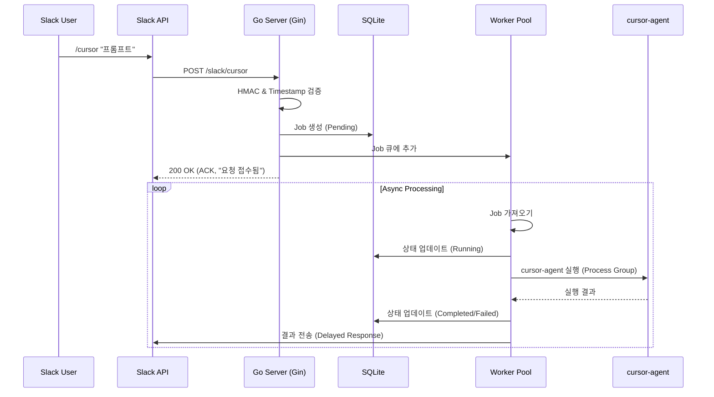

# System Architecture (v1.4)

이 문서는 **Slack-Cursor-CLI 연동 서버**의 시스템 아키텍처, 보안 설계 및 기술적 세부 사항을 다룹니다.

---

## 1. 시스템 개요

Slack 슬래시 커맨드(`/cursor`)를 통해 로컬 서버의 **Cursor Agent CLI**를 원격으로 실행하고 결과를 반환하는 Go 기반 중계 서버입니다.

### 주요 기능 (v1.4)
- **자연어 명령 처리**: `/cursor "main.go의 버그를 수정해줘"`와 같은 자연어 프롬프트 지원
- **비동기 작업 처리**: Worker Pool을 통한 안정적인 리소스 관리 및 동시성 제어
- **보안 강화**: HMAC-SHA256 서명 검증, 타임스탬프 검증, SSRF 방어, 프로세스 격리
- **작업 이력 관리**: SQLite 기반의 작업 요청 및 결과 영구 저장
- **유연한 설정**: Viper를 이용한 계층적 설정 관리 및 동적 프로젝트 경로 변경

---

## 2. 아키텍처 설계

### 2.1 전체 데이터 흐름



### 2.2 핵심 컴포넌트: Worker Pool

`os/exec`를 통한 외부 프로세스 실행은 비용이 높은 작업입니다. 요청 폭주(Thundering Herd)로 인한 시스템 리소스 고갈을 방지하기 위해 **Job Queue -> Dispatcher -> Worker Pool** 패턴을 적용했습니다.

- **Job Queue (`chan Job`)**: 수신된 모든 작업 요청을 버퍼링합니다.
- **Dispatcher**: 작업 큐를 모니터링하고 유휴 상태인 Worker에게 작업을 할당합니다.
- **Worker Pool**: 고정된 수(`MAX_WORKERS`, 기본 3)의 고루틴만 생성하여 동시에 실행되는 프로세스 수를 물리적으로 제한합니다.

### 2.3 보안 설계

1.  **Slack 요청 인증**:
    -   `X-Slack-Signature` 헤더를 사용하여 HMAC-SHA256 서명을 검증합니다.
    -   `X-Slack-Request-Timestamp`를 확인하여 5분 이상 지연된 요청(Replay Attack)을 거부합니다.

2.  **SSRF (Server-Side Request Forgery) 방어**:
    -   Slack으로 결과를 전송하는 `response_url`의 도메인을 검증합니다.
    -   `hooks.slack.com` 등 허용된 도메인으로만 HTTP 요청을 전송합니다.

3.  **프로세스 격리 및 안전한 실행**:
    -   **Timeout**: `context.WithTimeout`을 사용하여 작업이 지정된 시간(기본 15분)을 초과하면 강제 종료합니다.
    -   **Process Group**: `syscall.Setpgid`를 사용하여 자식 프로세스 그룹을 생성하고, 타임아웃 시 그룹 전체(`kill -PGID`)를 종료하여 좀비 프로세스를 방지합니다.
    -   **디렉토리 제한**: `cmd.Dir`을 설정하여 지정된 프로젝트 경로 내에서만 실행되도록 합니다.

---

## 3. Cursor Agent CLI 연동

### 3.1 실행 방식
Cursor Agent는 파일 경로를 명시적으로 지정하지 않고, 프로젝트 전체 컨텍스트를 기반으로 자연어 프롬프트를 처리합니다.

- **명령어 포맷**:
  ```bash
  cursor-agent -p "자연어 프롬프트" --force --output-format text
  ```
- **`--force`**: 파일 수정을 허용하기 위해 필수입니다.
- **`--files` 미사용**: v1.0 설계와 달리, 파일 경로는 파싱하지 않고 AI에게 일임합니다.

### 3.2 권한 관리
서버 실행 시 `CURSOR_PROJECT_PATH` 환경 변수(또는 API 설정)를 통해 지정된 경로를 루트로 하여 실행됩니다.

---

## 4. 데이터베이스 스키마 (SQLite)

작업 이력 관리를 위해 `jobs` 테이블을 사용합니다.

| 필드명 | 타입 | 설명 |
| :--- | :--- | :--- |
| `id` | TEXT (PK) | 작업 UUID |
| `prompt` | TEXT | 사용자 입력 프롬프트 |
| `status` | TEXT | `pending`, `running`, `completed`, `failed`, `cancelled` |
| `result` | TEXT | 실행 결과 또는 에러 메시지 |
| `created_at` | DATETIME | 생성 시간 |
| `updated_at` | DATETIME | 마지막 업데이트 시간 |
| `completed_at` | DATETIME | 완료 시간 |

---

## 5. 디렉토리 구조 (Standard Go Layout)

```
/
├── cmd/
│   └── server/          # 애플리케이션 진입점 (main.go)
├── internal/
│   ├── server/          # HTTP 서버 및 핸들러 (Gin)
│   ├── worker/          # Worker Pool 및 비즈니스 로직
│   ├── database/        # SQLite 데이터베이스 접근 계층
│   ├── setup/           # 초기 설정 마법사
│   └── ngrok/           # ngrok 터널링 관리
├── docs/
│   └── technical/       # 기술 문서
└── data/                # SQLite DB 파일 저장소
```

---

## 6. 설정 관리 (Configuration)

시스템 설정은 우선순위에 따라 로드됩니다:
1. API를 통한 런타임 설정 (동적 경로 등)
2. 환경 변수 (`.env` 포함)
3. 기본값

| 환경 변수 | 설명 | 기본값 |
| :--- | :--- | :--- |
| `SLACK_SIGNING_SECRET` | Slack 앱 서명 비밀키 (필수) | - |
| `CURSOR_PROJECT_PATH` | 작업 대상 프로젝트 경로 | - (API로 설정 가능) |
| `MAX_WORKERS` | 동시 실행 작업자 수 | 3 |
| `PORT` | 서버 포트 | 8080 |


